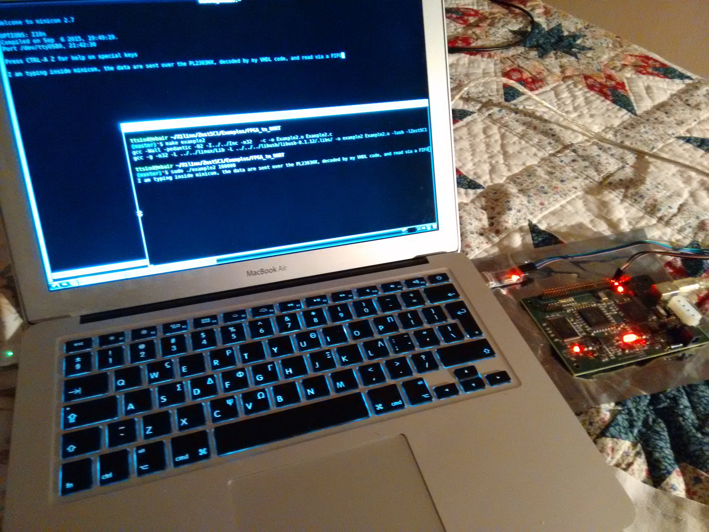

## My VHDL experiment - a UART of my own making

I started my career writing device drivers for 7 different FPGA designs.
I spent the next two decades writing software at all possible levels;
from device drivers, to GUIs, to real-time multithreaded processing
engines, to SSE, to CUDA, to parsers and code generators, to the web,
on both the backend and the frontend...

I am a true "full-stacker", to use a modern term.

Or am I?

I haven't done VHDL now, have I? :-)

## Let's make a UART

Over the last 3 weekends, I sat down with a trusty XC3S1000 and the
free Xilinx ISE WebPACK. and moved from example to example, learning
about signals and processes and state machines. And at some point,
I connected the TX and RX pins of my PL2303HX USB/TTL to the GPIO
pins of my FPGA board, and decided to write UART transmitting and
receiving of my own.

    --->        .------>        .------>        --->        .----->
        |       |       |       |       |           |       |Stop bit 
        |       |       |       |       |           |       |         
        |       |       |       |       |           |       |
        |       |       |       |       |           |       |
        |       | Bit 0 | Bit 1 | Bit 2 |   ...     |Bit 7  |
        |       |       |       |       |           |       |
        |       |       |       |       |           |       |
        |       |       |       |       |           |       |
        |       |       |       |       |           |       |
        |       |       |       |       |           |       |
        '------>        '------>        '---        '------>      
        Start bit                                       ^
                                                        |
    Samples must be taken in the middle of the pulses --'

UARTs follow a very simple protocol; with one start bit pulling down the
line to the LOW voltage, then the N bits of the octet, then one or
two stop bits (8N1 or 8N2), pulling the line back UP.

It turned out that transmitting serial data was child's play - I completed
it within a couple of hours, and it pretty much worked on the first try.
I simply had to count the appropriate number of cycles per baud,
so that I would transmit to my GPIO output pin at the appropriate
frequency: I chose 115200 baud as my target, so for my 48MHz FPGA,
I waited for...

  48000000/115200 =~ 416 cycles

...per baud.

Receiving however, and decoding properly, was another matter altogether,
The circuit had to synchronize to the droping of the start bit, so that
part of the circuit had to run at full speed (48MHz) - whereas after the
sync, it had to sample the 8 data bits at their middle (so, running
at the baud rate, with a phase shift).

And the samples themselves have noise, which one must filter for.

All these seem simple, basic rules in hindsight - but I discovered them
on my own as I went on, starting with a simple mirror of the TX circuit,
which seemed to work... until I started blasting data to it - and it
emitted gibberish... Realizing I must sync to it, then that I must save
the decoded data in a FIFO to decouple the C driver code that reads from
the VHDL code that writes...

All in all, fascinating stuff.

## Conclusion

In the end, I made it work - you can have a look at my code and see how
I solved the various issues. I chose to use my board's register interface
in the end (even though I begun with the streaming one), since that gave
me more control over what happens and when. It's good to know both of
them, though.

I have experienced mind-bending plenty of times...

- when I first learned LISP macros
- when I realized the power of discriminated unions checked at compile
time
- when I learned to think in functional style...
- etc

Well, VHDL was yet another mind bend.

Totally worth it - nothing like it.
